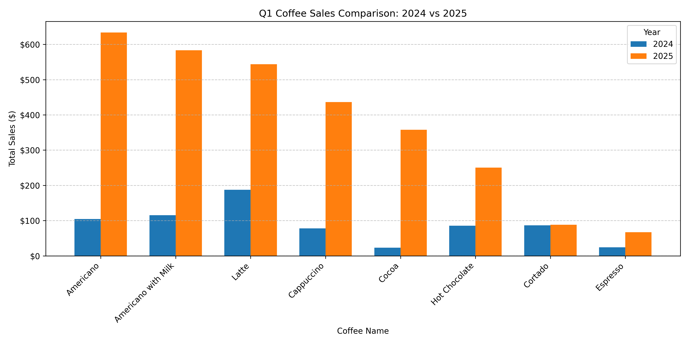

🚀 Agentic AI Labs – Jonathan Marx

Welcome to my personal repository for the **DeepLearning.AI Agentic AI** course series.
This repo documents my work as I build practical agent-based systems using:

* **LLM-driven code generation**
* **Reflection-based agents**
* **Autonomous workflows**
* **Multi-model reasoning (OpenAI, Google, Anthropic, Tavily)**

Each lab folder contains a *complete, reproducible agentic workflow* including code, charts, utilities, and documentation.

---

# 📁 Repository Structure

```
AgenticLabs/
│
├── labs/
│   ├── 01_agentic_workflow/
│   │     ├── M2_UGL_1.ipynb
│   │     ├── utils.py
│   │     ├── coffee_sales.csv
│   │     ├── chart_v1.png
│   │     ├── chart_v2.png
│   │     ├── coffee_quarterly_v1.png
│   │     ├── coffee_quarterly_v2.png
│   │     ├── drink_sales_v1.png
│   │     ├── drink_sales_v2.png
│   │     └── README.md
│   └── (More labs coming soon)
│
├── README.md     ← (this file)
├── .gitignore
└── requirements.txt
```

---

# 🧪 Lab 1 – Agentic Workflow with Reflection

📍 **Folder:** `labs/01_agentic_workflow`

This lab implements a **four-step reflection-based agent** that automatically:

1. **Generates Python code** from a natural language instruction
2. **Executes that code** to produce a first-version chart
3. **Reflects** on the chart and the code using an LLM
4. **Regenerates improved code** and executes a refined version

### 🔧 Technologies Used

* **Python**
* **Matplotlib / Pandas**
* **OpenAI GPT-4o-mini & GPT-4.1**
* **Anthropic Claude (optional)**
* **Tavily Search API (optional)**
* **dotenv for secure API key loading**

### 📊 Example Outputs

**V1 – First Draft Code Output**


**V2 – Improved Chart After Reflection**



---

# 🎯 Goals of This Repository

✔ Build a growing portfolio of real agent-based AI projects
✔ Demonstrate hands-on mastery of LLM-driven automation
✔ Showcase reflection-based systems, evaluation loops, and tool use
✔ Track progress through the Agentic AI course

---

# 🔧 Setup Instructions

### 1. Clone the repository

```bash
git clone https://github.com/jonathanlmarx/AgenticLabs-JonathanMarx.git
cd AgenticLabs-JonathanMarx
```

### 2. Create and activate a virtual environment

```bash
python -m venv venv
.\venv\Scripts\activate   # Windows
```

### 3. Install dependencies

```bash
pip install -r requirements.txt
```

### 4. Add your API keys to a `.env` file

```
OPENAI_API_KEY=your-openai-key
GOOGLE_API_KEY=your-google-key
ANTHROPIC_API_KEY=your-anthropic-key
TAVILY_API_KEY=your-tavily-key
```

---

# 📌 Upcoming Labs

I will continue adding labs as I progress through the Agentic AI curriculum:

* **Reflection Patterns**
* **Agent Architectures**
* **Planning Agents**
* **Multi-Agent Orchestration**
* **Tool-Using Agents**
* **Retrieval-Augmented Agents**

Stay tuned for more!

---

# 👤 About Me

**Jonathan Marx**
Data Scientist | Business Analyst | AI Engineer-in-Training
Passionate about agentic AI systems, LLM engineering, and end-to-end intelligent pipelines.

🔗 GitHub: [https://github.com/jonathanlmarx](https://github.com/jonathanlmarx)
📧 Email: [jonathan.l.marx@gmail.com](mailto:jonathan.l.marx@gmail.com)

---

# ⭐ If you found this interesting…

Consider starring the repository — it helps visibility and encourages further development!

